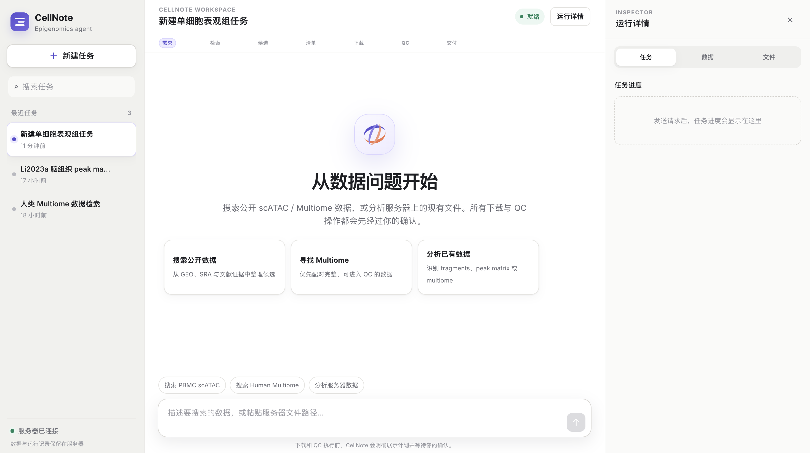

# CellNote Agent

[](https://www.python.org/)
[](https://fastapi.tiangolo.com/)
[](#analysis-paths)
[](#analysis-paths)

**An interactive agent for scATAC-seq and Multiome dataset discovery, controlled download, quality control, and peak-matrix delivery.**

CellNote Agent turns natural-language requests or existing local datasets into
auditable analysis plans and deterministic pipeline executions. Its canonical
output is an independent, per-dataset **GRCh38 cell-by-peak matrix** together
with a QC summary, data card, and manifest.

<p align="center">
  
</p>

<p align="center"><em>CellNote Agent workspace for public-data discovery and controlled scATAC-seq or Multiome analysis.</em></p>

## Capabilities at a glance

| Component | Role |
|---|---|
| Natural-language planning | Extracts modality, species, tissue or disease, genome build, file format, and size preferences from user requests |
| Public-data discovery | Searches configured GEO, SRA/ENA, literature, and optional external crawler adapters |
| Candidate review | Organizes datasets and downloadable files without claiming unsupported biological metadata |
| Controlled download | Builds a file manifest and executes `plan → fetch → verify` only after user confirmation |
| Existing-input detection | Detects fragments, cell-by-peak matrices, and paired RNA–ATAC Multiome inputs from local files or directories |
| Modality-aware QC | Routes inputs to deterministic fragments, peak-matrix, or Multiome processing scripts |
| Auditable delivery | Produces a GRCh38 peak matrix, QC summary, data card, manifest, logs, and provenance records |

The language model is used for intent interpretation, evidence-grounded
clarification, and readable reports. It does not directly fabricate
bioinformatics outputs or bypass the local execution gates.

## Benchmarks

The two benchmarks use the same StepFun model and two representative scATAC
routes: Li2023a existing peak-matrix QC and Li2023b fragments-to-peak-matrix
processing. The complete compact package is available in
[`agent_benchmark/`](agent_benchmark/README.md).

### Benchmark design

| Benchmark | Comparison | Main question |
|---|---|---|
| **1** | StepFun model only vs. StepFun + CellNote skills | Do constrained, deterministic skills improve execution efficiency and validated delivery over open-ended tool use? |
| **2** | StepFun + CellNote skills vs. StepFun + frozen public skills | Do CellNote's route-specific skills improve repeat consistency and preserve stable workflow semantics relative to reusable public skills? |

The Benchmark 1 model-only baseline can use generic shell and Python tools with
SnapATAC2, MACS3, Scanpy, and AnnData, but cannot access CellNote scripts,
skills, previous outputs, or prior QC summaries. Benchmark 2 uses the frozen
K-Dense-AI `anndata` skill for Li2023a and the GPTomics
`bio-atac-seq-single-cell-atac` skill for Li2023b.

### Benchmark 1 summary

| Dataset / route | StepFun only | StepFun + CellNote skills | Main result |
|---|---:|---:|---|
| **Li2023a peak-matrix QC** | 28.3 ± 12.4 min; 80.6 ± 12.2 GB | 8.9 ± 0.3 min; 43.2 ± 0.0 GB | **3.17× faster** and **46.4% lower peak RSS** with CellNote skills |
| **Li2023b fragments → peaks** | One attempt exceeded 12 h with no output | 75.4 ± 12.1 min; 3/3 validated, repeat-identical outputs | CellNote converted a failed open-ended run into a bounded, reproducible delivery |

For Li2023a, the model-only process returned normally in 3/3 runs, but package
validation and repeat-hash consistency were not independently reported. Its
100% cell retention is therefore not interpreted as evidence of better QC.
CellNote produced a validated GRCh38 package containing 731,023 cells and
544,729 peaks in all three repeats.

### Benchmark 2 summary

| Dataset / route | CellNote skills | Frozen public skills | Interpretation |
|---|---:|---:|---|
| **Li2023a peak-matrix QC** | 3/3 modal outcome; 8.9 min; 43.2 GB | 2/3 modal outcome; 25.4 min; 107.4 GB | CellNote was faster, used less memory, and preserved repeat-identical semantics |
| **Li2023b fragments → peaks** | 3/3 modal outcome; 75.4 min; 30.5 GB | 3/3 modal outcome; 65.3 min; 25.0 GB | Both were repeat-consistent, but the external route omitted clustering and doublet removal, so runtime is not a like-for-like comparison |

All twelve Benchmark 2 runs passed the common file validator and network audit.
However, one external Li2023a repeat produced a different cell set despite
passing file-level validation, reducing its modal-outcome consistency to 2/3.
This distinction separates **valid files** from **stable workflow semantics**.

The package includes baseline code, compact run-level and aggregate CSV files,
figures, design materials, a package manifest, and SHA-256 checksums. Large
biological inputs, generated matrices, runtime environments, and credentials
are excluded.

## Workflow

```text
Natural-language request or existing local data
                    │
                    ├── public-data discovery ──> candidate datasets
                    │                                  │
                    │                                  └── manifest review
                    │                                          │
                    │                                  plan → fetch → verify
                    │
                    └── local input detection
                               │
              ┌────────────────┼────────────────┐
              │                │                │
         fragments        peak matrix       Multiome
              │                │                │
              └────────────────┼────────────────┘
                               │
                     modality-specific QC
                               │
              GRCh38 cell-by-peak matrix package
```

## Installation

CellNote Agent requires Python 3.10 or newer. Clone the repository and install
the core package and web dependencies in an isolated environment:

```bash
git clone https://github.com/inulxy/cell-note-agent.git
cd cell-note-agent

conda create -n cellnote-agent python=3.10 -y
conda activate cellnote-agent

python -m pip install --upgrade pip
python -m pip install -e .
python -m pip install -r requirements-web.txt
```

The modality-specific environments can be created as needed:

```bash
conda env create -f environment-snapatac2.yml
conda env create -f environment-muon.yml
conda env create -f environment-curator.yml
```

These environments separate the heavier SnapATAC2, Scanpy/AnnData, MuData,
and curation dependencies from the lightweight agent service.

## StepFun API configuration

The deterministic pipeline can run without a language model, but StepFun API
integration enables natural-language intent parsing, adaptive clarification,
and evidence-grounded stage reports.

Create a server-only configuration file:

```bash
cp configs/web.env.example configs/web.env
chmod 600 configs/web.env
```

Edit `configs/web.env`:

```bash
STEP_API_KEY=your-stepfun-api-key
STEP_API_BASE_URL=https://api.stepfun.com/v1
STEP_API_MODEL=step-3.5-flash
STEP_API_TIMEOUT_SECONDS=60

# Optional service settings
CELLNOTE_WEB_PORT=8787
CELLNOTE_WEB_WORKSPACES=/absolute/path/to/web-workspaces
CELLNOTE_WEB_STATE=/absolute/path/to/web-state
```

`configs/web.env` is excluded from Git. Never place a real API key in source
code, browser JavaScript, screenshots, or commit history.

## Launching CellNote Agent

Start the FastAPI service directly:

```bash
set -a
source configs/web.env
set +a

export CELLNOTE_REPO_ROOT="$PWD"
python -m uvicorn cell_note_agent.web.app:app \
  --host 127.0.0.1 \
  --port "${CELLNOTE_WEB_PORT:-8787}"
```

Open `http://127.0.0.1:8787` in a browser.

For a server deployment, run the service in tmux:

```bash
mkdir -p runs/web-service
tmux new-session -d -s cellnote-web \
  'bash -lc "cd /path/to/cell-note-agent && ./run_cellnote_web.sh >> runs/web-service/server.log 2>&1"'

tmux attach -t cellnote-web
```

The bundled `run_cellnote_web.sh` contains a server-specific Python path. Edit
that path to match the target Conda environment before deployment.

If the service is bound to the server loopback interface, create an SSH tunnel
from the client computer:

```bash
ssh -L 8787:127.0.0.1:8787 your-server
```

Keep the tunnel open and visit `http://127.0.0.1:8787` locally.

## Agent usage examples

### Discover and download public data

Create a task and enter a natural-language request such as:

```text
Find public human 10x Multiome datasets. Prefer GRCh38 and processed matrices,
with no individual dataset larger than 20 GB.
```

The agent infers conditions already present in the request and asks only for
missing information. After discovery, it summarizes the evidence and retains
the candidate table without starting a download automatically.

To continue:

```text
Select and download the smallest dataset that is ready for direct analysis.
```

Review the generated manifest, file roles, and expected sizes. The actual
transfer starts only after explicit confirmation.

### Analyze existing server data

Provide an absolute file or directory path:

```text
Analyze /data/Li2023a-brain_tissue-cell_by_peak.h5ad and deliver a GRCh38 peak-matrix package.
```

For a fragments collection:

```text
Analyze /data/Li2023b/fragments_standardized/, detect the input type, run QC,
and generate a peak matrix.
```

The agent first reports the detected input type, scale, recommended route, and
QC plan. Deterministic analysis begins only after confirmation.

### Pause a task

While a search, manifest, download, or QC task is running, enter:

```text
Pause
```

The service preserves available logs and intermediate outputs so the task can
be inspected or resumed from the controlled interface.

## Using the agent in a terminal

Load the API environment and verify the connection:

```bash
cp .env.example .env
set -a
source .env
set +a

python -m cell_note_agent.step_api chat "Reply with OK"
```

Start the interactive terminal agent:

```bash
./cell-note agent
```

Example session:

```text
cell-note> Find public human PBMC scATAC datasets and prefer processed peak matrices or fragments.
cell-note> Download the smallest analysis-ready candidate.
cell-note> Run standard QC on the downloaded input and deliver a GRCh38 peak matrix.
cell-note> exit
```

Analyze existing data directly:

```text
cell-note> Analyze /absolute/path/to/input and automatically select the fragments, peak-matrix, or Multiome route.
```

Run one instruction and exit:

```bash
./cell-note agent --once \
  "Analyze /absolute/path/to/input and deliver a GRCh38 peak-matrix package"
```

## Direct command-line workflows

Run the deterministic offline demo:

```bash
./cell-note demo --out runs/demo-pbmc-multiome
./cell-note status --run runs/demo-pbmc-multiome
```

Run public metadata discovery:

```bash
./cell-note --config configs/mvp.json crawl \
  --query "PBMC 10x multiome" \
  --source geo \
  --source sra \
  --source literature \
  --limit 20 \
  --out runs/crawl-pbmc \
  --run-id crawl-pbmc
```

Execute a controlled manifest download:

```bash
./cell-note download --stage plan \
  --manifest /path/to/file_manifest.csv \
  --store runs/raw

./cell-note download --stage fetch \
  --manifest /path/to/file_manifest.csv \
  --store runs/raw \
  --enable_fetch

./cell-note download --stage verify \
  --manifest /path/to/file_manifest.csv \
  --store runs/raw
```

Real file transfer is guarded. The fetch stage requires the explicit
`--enable_fetch` flag.

## Pi Coding Agent integration

Install and configure Pi:

```bash
npm install -g @earendil-works/pi-coding-agent
./setup_pi.sh
pi
```

Inside Pi, activate the CellNote router:

```text
/skill:sc-epi-agent
```

See [`docs/STEP_PI_INTEGRATION.md`](docs/STEP_PI_INTEGRATION.md) for the full
integration guide.

## Analysis paths

### scATAC fragments

```text
single fragments file or fragments collection
        → input validation and standardization
        → SnapATAC2-based cell QC
        → per-dataset peak calling
        → GRCh38 cell-by-peak matrix
```

### scATAC peak matrix

```text
cell-by-peak matrix
        → matrix and coordinate validation
        → cell and peak filtering
        → optional embedding and clustering
        → GRCh38 cell-by-peak matrix
```

### Multiome

```text
paired RNA and ATAC input
        → modality and pairing validation
        → RNA and ATAC quality control
        → barcode/intersection checks
        → GRCh38 ATAC cell-by-peak matrix
```

QC thresholds can use lenient, standard, strict, or custom presets. All
bioinformatics operations are executed by versioned local scripts rather than
generated by the language model.

## Output package

A completed dataset package may contain:

| Output | Description |
|---|---|
| Peak matrix | Filtered per-dataset GRCh38 cell-by-peak matrix |
| Peak coordinates | Genomic intervals associated with matrix columns |
| Barcodes | Cell identifiers in matrix row order |
| QC summary | Thresholds, before/after dimensions, and stage outcomes |
| Data card | Dataset identity, input evidence, processing route, and limitations |
| Manifest | File paths, sizes, checksums when available, and provenance |

Large datasets, downloads, references, generated matrices, and runtime state
are intentionally excluded from the Git repository.

## Skills

| Type | Skills |
|---|---|
| Router | `sc-epi-agent`, `external-skill-router` |
| Entry points | `curation-pipeline`, `processing-pipeline`, `handoff-pipeline` |
| Core processing | `scatac-fragment-qc`, `scatac-peak-matrix`, `multiome-qc` |
| Supporting | `normalize-to-peak-matrix`, `resource-setup`, `download-validate` |
| Interaction policy | `agent-dialogue-governance` |

## Repository structure

```text
cell-note-agent/
├── cell_note_agent/       # agent, StepFun adapter, web backend, and Pi bridge
├── web_static/            # browser interface
├── sc_epi_curator/        # public metadata discovery backend
├── scripts/               # deterministic stage-based processing scripts
├── skills/                # SKILL.md execution and interaction contracts
├── configs/               # versioned configuration and environment templates
├── docs/                  # architecture and integration documentation
├── figures/               # README and architecture figures
└── tests/                 # unit and integration tests
```

## Safety and reproducibility

- API keys remain server-side and are excluded from Git.
- Search, download, and QC stages retain provenance and execution logs.
- Large downloads and substantive QC operations require explicit confirmation.
- Manifest validation records expected sizes, checksums when available, local
  paths, and missing or corrupt files.
- Unsupported or ambiguous inputs are routed to review instead of an uncertain
  analysis path.
- Reports distinguish verified facts, metadata-derived inferences, plans, and
  unknown information.

## Project status

CellNote Agent is research software under active development. Public-data
coverage depends on the configured source APIs and adapters. Metadata discovery
does not by itself establish biological validity or guarantee the availability
of processed matrices. Users should review candidate metadata, download
manifests, QC thresholds, and final data cards before downstream use.

## Documentation

- [`WEB_UI.md`](WEB_UI.md) — web-service deployment and access
- [`docs/EXECUTABLE_FRAMEWORK.md`](docs/EXECUTABLE_FRAMEWORK.md) — executable agent framework and skills
- [`docs/PIPELINE_DESIGN.md`](docs/PIPELINE_DESIGN.md) — end-to-end pipeline design
- [`docs/STEP_PI_INTEGRATION.md`](docs/STEP_PI_INTEGRATION.md) — StepFun API and Pi integration
- [`docs/EXTERNAL_SKILLS.md`](docs/EXTERNAL_SKILLS.md) — external skill management
- [`skills/README.md`](skills/README.md) — skill contract conventions
